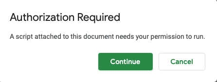

# update-do-not-airlock-checklist

# Introduction
If you play Star Trek Timelines, there is a Google Sheets tool available called the [Do Not Airlock checklist](https://forum.disruptorbeam.com/stt/discussion/15561/do-not-airlock-checklist-thread-4/p1).

These scripts are for people who use that Google Sheet and make it easy to import/copy over your info from your old Sheet to the new one when there's an update.

# Usage/Installation

First, copy the url of your old Google Sheet (aka GS). You'll need this later.

Make a copy of the new Checklist and create a new tab called **UpgradeFromOldGs**.\
Paste the url of your old Google Sheet into cell A1. Note that it *must* be in cell A1.

From here, all actions should be done on the new GS.

Go to the **Tools** menu and select **Script Editor**.\
A new tab should open and you'll probably see some code there already, and it probably starts with `function pullData() {`\
You'll want to ignore it and leave it alone. 

Copy the contents from the [Code.gs](https://github.com/edjusted/update-do-not-airlock-checklist/blob/main/Code.gs) file here and paste it into the Script Editor tab *below* any existing code (i.e. don't overwrite any existing code).\
Click the save button to save.

Go back to the new GS window and reload the page.\
After a few seconds, you should see a new menu called **Upgrade from old Checklist**.
Click on that, and select **Import/overwrite Crew & Crew Notes**.\
      \
    **Important**: The first time you select this option, Google will ask you to grant permissions to the script. Go through the steps and **Allow** the permissions.\
    You will then need to select the menu option *again* to actually run it. (The first "run" kicks off the permission process but doesn't actually run the scripts.)

**Note**: technically, this copies over your Crew Notes and the contents of the old **Import** tab.\
If you manage your Crew manually (*without* using the **Import** tab, only your Crew Notes will be copied over.

# Options

If you created additional tabs in the old GS for your own purposes and you also want to copy those over, you can do that.\
First, go to the **UpgradeFromOldGs** tab that you created on the new GS.\
In cell A2, type in the *exact* name(s) of the tab(s) you want to copy over, separated by a comma if there are multiple tabs.

Then, go to the menu called **Upgrade from old Checklist** and select **Copy over user tabs**
